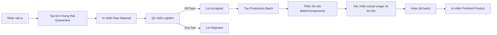

# 01 - Product Requirements Document

## 1. Mục tiêu tài liệu

Tài liệu này mô tả yêu cầu sản phẩm cho hệ thống quản lý kho vật tư và lô sản xuất, tập trung vào:

- Các vai trò sử dụng hệ thống.
- Các vấn đề hiện tại trong vận hành thực tế.
- Các mục tiêu nghiệp vụ cần đạt được.
- Các luồng nghiệp vụ chính (bao gồm cả bước thủ công và bước trên hệ thống).
- Các yêu cầu chức năng, phi chức năng và tiêu chí chấp nhận ở mức sản phẩm.

## 2. Bối cảnh và phạm vi nghiệp vụ

### 2.1 Bối cảnh

Doanh nghiệp sản xuất cần kiểm soát vòng đời vật tư theo lô, từ lúc nhận hàng, kiểm nghiệm chất lượng (QC), cấp phát vào sản xuất, đến in nhãn và truy xuất lịch sử. Mô hình hiện tại có nhiều thao tác thủ công, dễ gây sai lệch số liệu tồn kho và khó truy vết khi có sự cố chất lượng.

### 2.2 Phạm vi trong giai đoạn hiện tại

- Quản lý master data vật tư/sản phẩm.
- Nhập kho theo lô và quản lý vòng đời lot.
- Quản lý QC test cho lot.
- Quản lý đợt sản xuất (production batch) và cấp phát nguyên liệu.
- In nhãn theo template cho lot/batch.
- Theo dõi giao dịch kho (inventory transactions) để truy xuất nguồn gốc.

### 2.3 Ngoài phạm vi (out of scope) giai đoạn hiện tại

- Lập kế hoạch sản xuất nâng cao (MRP/APS).
- Quản lý mua hàng và nhà cung cấp đầy đủ (PO lifecycle end-to-end).
- Quản lý bảo trì máy móc (CMMS).
- Tích hợp sâu với ERP bên ngoài (nếu có, sẽ thực hiện ở phase sau).

## 3. Vai trò người dùng và mục tiêu theo vai trò

### 3.1 Admin

- Vấn đề hiện tại:
  - Danh mục vật tư, template nhãn và phân quyền phân tán, khó kiểm soát phiên bản.
- Mục tiêu:
  - Quản lý tập trung master data và cấu hình hệ thống.
  - Đảm bảo phân quyền rõ ràng theo vai trò.

### 3.2 Operator (Kho vận)

- Vấn đề hiện tại:
  - Nhập/xuất kho theo lô ghi nhận rời rạc, khó đối chiếu tồn thực tế và tồn hệ thống.
- Mục tiêu:
  - Ghi nhận nhanh, đúng và đủ các giao dịch Receipt/Usage/Split/Adjustment/Transfer/Disposal.
  - Luôn biết lô nào có thể dùng cho sản xuất.

### 3.3 QC

- Vấn đề hiện tại:
  - Kết quả kiểm nghiệm chưa liên kết chặt với trạng thái lot, gây rủi ro cấp phát nhầm lô.
- Mục tiêu:
  - Quản lý kết quả kiểm nghiệm theo từng lot.
  - Tự động kiểm soát trạng thái Quarantine/Accepted/Rejected theo rule nghiệp vụ.

### 3.4 Manager/Operator (Sản xuất)

- Vấn đề hiện tại:
  - Cấp phát nguyên liệu cho batch dễ sai định mức và khó truy xuất lot đã dùng.
- Mục tiêu:
  - Tạo và quản lý production batch có đầy đủ thành phần nguyên liệu.
  - Tự động trừ tồn theo actual usage, có traceability đầy đủ.

### 3.5 Manager (Chất lượng và tuân thủ)

- Vấn đề hiện tại:
  - Mất thời gian tổng hợp lịch sử biến động để điều tra sai lệch/chất lượng.
- Mục tiêu:
  - Có báo cáo và audit trail rõ ràng, truy xuất nhanh theo lot và batch.

## 4. Vấn đề cốt lõi cần giải quyết

- Sai lệch tồn kho do ghi nhận thủ công và thiếu chuẩn hóa transaction.
- Trạng thái lot không đồng bộ với kết quả QC.
- Cấp phát nguyên liệu cho batch thiếu kiểm tra điều kiện dùng được.
- In nhãn chưa nhất quán, dễ thiếu thông tin bắt buộc.
- Truy xuất nguồn gốc lot-batch chậm khi có sự cố.

## 5. Mục tiêu sản phẩm và chỉ số thành công

### 5.1 Mục tiêu sản phẩm

- Chuẩn hóa toàn bộ vòng đời lot từ Receipt đến Depleted.
- Đảm bảo chỉ lot hợp lệ mới được đưa vào sản xuất.
- Tạo liên kết truy xuất xuyên suốt giữa lot, QC test, transaction và production batch.
- Chuẩn hóa in nhãn theo template.

### 5.2 Chỉ số thành công (KPI)

- 100% giao dịch kho có audit user và timestamp.
- 100% lot dùng cho sản xuất có trạng thái Accepted tại thời điểm cấp phát.
- Thời gian truy xuất lịch sử một lot bất kỳ dưới 30 giây.
- Giảm tối thiểu 50% lỗi nhập liệu thủ công sau khi vận hành ổn định.

## 6. Luồng nghiệp vụ tổng quan (business workflow)

## 7. Luồng nghiệp vụ chi tiết (bao gồm bước thủ công và bước hệ thống)

### 7.1 Luồng chính: Từ nhập kho đến hoàn tất sản xuất

1. Operator nhận vật tư và kiểm tra chứng từ (thủ công).
2. Operator tạo Inventory Lot trên hệ thống với trạng thái Quarantine.
3. Hệ thống ghi Receipt transaction và cập nhật tồn.
4. Operator in nhãn Raw Material để dán lô vật lý.
5. QC thực hiện kiểm nghiệm (một phần thủ công ở phòng lab, một phần nhập liệu lên hệ thống).
6. QC/Manager cập nhật kết quả; hệ thống tự động đổi trạng thái lot:
   - All pass: Accepted.
   - Có fail: Rejected.
7. Manager/Operator tạo batch cho sản phẩm mục tiêu.
8. Manager/Operator thêm lot hợp lệ vào batch và nhập actual usage.
9. Hệ thống tạo Usage transaction, trừ tồn lot và kiểm tra depleted.
10. Batch chuyển Complete khi đủ điều kiện; in nhãn Finished Product.

### 7.2 Luồng phụ: Tạo sample lot

1. QC/Operator yêu cầu tách mẫu từ lot gốc.
2. Hệ thống tạo sample lot với is_sample=true và parent_lot_id.
3. Hệ thống ghi transaction tách mẫu để cân bằng tồn.
4. In nhãn Sample cho lot mẫu.

### 7.3 Luồng phụ: Điều chỉnh và xử lý ngoại lệ

1. Khi có chênh lệch kiểm kê, Operator thực hiện Adjustment kèm lý do.
2. Khi lot không còn sử dụng được, thực hiện Disposal theo quyền hạn.
3. Mọi thao tác đều để lại audit trail phục vụ kiểm soát tuân thủ.

## 8. Yêu cầu chức năng

### FR-01 Quản lý người dùng và phân quyền

- Hệ thống hỗ trợ vai trò: Admin, Manager, QC, Operator.
- Mọi thao tác quan trọng ghi nhận performed_by/added_by/verified_by.

### FR-02 Quản lý master data Materials

- Tạo/sửa/xóa/xem Materials.
- part_number là duy nhất.
- Quản lý material_type, specification_document và thông tin liên quan.

### FR-03 Nhập kho theo lot

- Tạo lot mới với thông tin bắt buộc: material_id, quantity, UOM, received_date, expiration_date.
- Lot mới mặc định ở trạng thái Quarantine.
- Tự động tạo Receipt transaction dương.

### FR-04 Quản lý QC test

- Một lot có thể có nhiều QC tests.
- Mỗi test có trạng thái Pending/Pass/Fail.
- Hệ thống tự động cập nhật trạng thái lot theo rule all-pass/any-fail.

### FR-05 Quản lý production batch

- Tạo batch cho product_id.
- Vòng đời batch: Planned -> In Progress -> Complete/Rejected.
- Quản lý thành phần nguyên liệu qua BatchComponents.

### FR-06 Cấp phát nguyên liệu và trừ tồn

- Khi xác nhận actual_quantity, hệ thống tạo Usage transaction âm.
- Không cho phép cấp phát khi lot:
  - Không ở trạng thái Accepted.
  - Không đủ tồn.
  - Đã hết hạn hoặc bị đánh dấu không hợp lệ.

### FR-07 Quản lý sample lot

- Cho phép tách sample lot từ lot cha.
- Lưu parent_lot_id, is_sample và ghi transaction tương ứng.

### FR-08 In nhãn theo template

- Quản lý LabelTemplates theo label_type: Raw Material, Sample, Finished Product, Status.
- Cho phép preview và in nhãn từ dữ liệu lot/batch.

### FR-09 Truy xuất lịch sử và báo cáo

- Truy xuất toàn bộ InventoryTransactions theo lot hoặc batch.
- Cung cấp báo cáo tồn kho theo trạng thái, hạn dùng và vị trí lưu trữ.

### FR-10 Audit trail

- Ghi nhận lịch sử thay đổi dữ liệu quan trọng.
- Không cho phép sửa/xóa trái phép dữ liệu lịch sử giao dịch.

## 9. Yêu cầu phi chức năng

### NFR-01 Bảo mật

- Xác thực và phân quyền theo RBAC.
- API chỉ cho phép thao tác phù hợp quyền người dùng.

### NFR-02 Hiệu năng

- Các thao tác chính (xem danh sách lot, chi tiết batch, lịch sử transaction) phản hồi mục tiêu dưới 2 giây trong điều kiện tải tiêu chuẩn.

### NFR-03 Độ tin cậy và toàn vẹn dữ liệu

- Dữ liệu giao dịch phải nhất quán, không mất bản ghi khi có lỗi tạm thời.
- Có cơ chế backup định kỳ.

### NFR-04 Khả năng truy xuất và tuân thủ

- Mọi giao dịch quan trọng có dấu vết người thực hiện và thời gian.
- Hỗ trợ trích xuất dữ liệu phục vụ kiểm tra nội bộ/chất lượng.

## 10. Quy tắc nghiệp vụ chính

- BR-01: Lot mới nhập kho bắt buộc ở trạng thái Quarantine.
- BR-02: Lot chỉ được cấp phát cho sản xuất khi trạng thái là Accepted.
- BR-03: Nếu bất kỳ QC test nào Fail thì lot chuyển Rejected.
- BR-04: Khi quantity lot về 0, hệ thống có thể chuyển trạng thái Depleted.
- BR-05: Batch chỉ Complete khi các thành phần nguyên liệu đã được xác nhận usage theo tiêu chí vận hành.
- BR-06: Mọi thay đổi tồn kho phải đi qua InventoryTransactions, không chỉnh trực tiếp số lượng mà không có lý do nghiệp vụ.

## 11. Bảng dữ liệu cốt lõi theo workflow

### 11.1 Users

- Mục đích: quản lý tài khoản và audit.
- Trường chính: user_id, username, email, role, is_active, last_login, created_date, modified_date.

### 11.2 Materials

- Mục đích: master data vật tư/sản phẩm.
- Trường chính: material_id, part_number, material_name, material_type, specification_document, storage_conditions, created_date, modified_date.

### 11.3 InventoryLots

- Mục đích: quản lý tồn kho theo lô.
- Trường chính: lot_id, material_id, quantity, unit_of_measure, status, received_date, expiration_date, is_sample, parent_lot_id.

### 11.4 InventoryTransactions

- Mục đích: ghi nhận biến động kho.
- Loại giao dịch: Receipt, Usage, Split, Transfer, Adjustment, Disposal.
- Trường chính: transaction_id, lot_id, transaction_type, quantity, reference_id, performed_by, transaction_date.

### 11.5 QCTests

- Mục đích: lưu kết quả kiểm nghiệm.
- Trường chính: qc_test_id, lot_id, test_type, test_method, result_status, performed_by, verified_by, test_date.

### 11.6 ProductionBatches

- Mục đích: quản lý đợt sản xuất.
- Trường chính: batch_id, product_id, batch_number, batch_size, unit_of_measure, manufacture_date, expiration_date, status.

### 11.7 BatchComponents

- Mục đích: liên kết lot nguyên liệu với batch.
- Trường chính: batch_component_id, batch_id, lot_id, planned_quantity, actual_quantity, addition_date, added_by.

### 11.8 LabelTemplates

- Mục đích: quản lý mẫu nhãn.
- Trường chính: template_id, label_type, template_content, width, height, created_date, modified_date.

## 12. Luồng thay đổi dữ liệu chi tiết theo bước

### Bước 0 - Đăng nhập

- Bảng ảnh hưởng: Users.
- Ví dụ thay đổi: last_login từ NULL sang timestamp hiện tại.

### Bước 1 - Tạo Material

- Bảng tạo mới: Materials.
- Ví dụ: material_id=MAT-001, material_type=API.

### Bước 2 - Nhập kho lot

- Bảng tạo mới: InventoryLots và InventoryTransactions.
- Ví dụ: Receipt +25.500 kg cho lot-uuid-001.

### Bước 3 - In nhãn Raw Material

- Bảng đọc: LabelTemplates, InventoryLots, Materials.
- Không bắt buộc phát sinh bản ghi mới nếu chưa có bảng log in nhãn.

### Bước 4 - QC cho lot

- Bảng tạo mới: QCTests.
- Bảng cập nhật: InventoryLots.status Quarantine -> Accepted hoặc Rejected.

### Bước 5 - Tách sample lot

- Bảng tạo mới: InventoryLots (lot con).
- Bảng tạo mới: InventoryTransactions (Split/Receipt theo rule thiết kế).
- Bảng cập nhật: quantity lot cha giảm tương ứng.

### Bước 6 - Tạo Production Batch

- Bảng tạo mới: ProductionBatches.
- Trạng thái khởi tạo: Planned.

### Bước 7 - Add nguyên liệu vào batch và usage

- Bảng tạo mới: BatchComponents và InventoryTransactions (Usage âm).
- Bảng cập nhật: InventoryLots.quantity giảm theo actual usage.

### Bước 8 - Hoàn tất batch và in nhãn thành phẩm

- Bảng cập nhật: ProductionBatches.status In Progress -> Complete.
- Bảng đọc để in nhãn: LabelTemplates, ProductionBatches, Materials.

### Bước 9 - In nhãn trạng thái khi cần

- Khi lot/batch đổi trạng thái quan trọng, hệ thống cho phép generate nhãn Status.

## 13. Tiêu chí chấp nhận tổng thể cho PRD

- Có mô tả rõ vai trò, vấn đề và mục tiêu theo vai trò.
- Có luồng nghiệp vụ chính và luồng phụ từ góc nhìn vận hành thực tế.
- Có mô tả bước thủ công và bước thực hiện trên hệ thống.
- Có đầy đủ nhóm yêu cầu chức năng và phi chức năng cốt lõi.
- Có business rules để kiểm soát trạng thái lot, batch, QC và giao dịch kho.
- Có mô tả dữ liệu chính và biến động dữ liệu theo workflow.

## 14. Giả định và ràng buộc

- Hệ thống xác thực/ủy quyền sử dụng công cụ có sẵn của dự án (không tự phát triển IAM từ đầu).
- Tất cả thời điểm giao dịch sử dụng cùng chuẩn múi giờ đã thống nhất toàn hệ thống.
- Quy định QC chi tiết theo từng loại vật tư có thể được bổ sung trong các sprint tiếp theo.

## 15. Truy vết sang tài liệu liên quan

- Domain model chi tiết thực thể và quan hệ: 02_Domain Model.md.
- Danh sách story và ưu tiên triển khai: 04_Product Backlog.md.
- Kiến trúc giải pháp và cấu trúc hệ thống: 05_Architecture.md.
