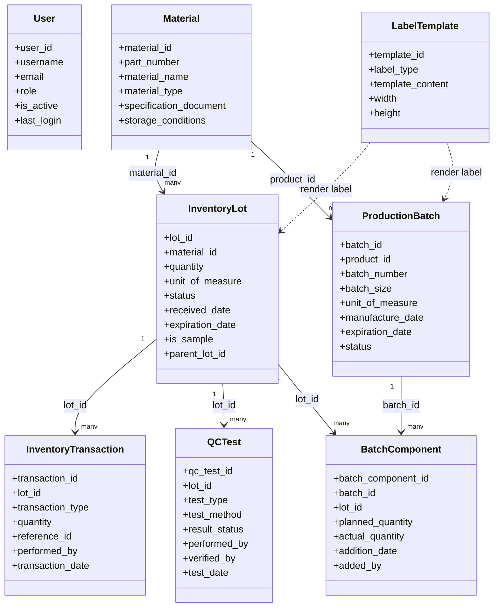

# 02 - Domain Model

## 1. Mục tiêu tài liệu

Tài liệu này mô tả mô hình miền nghiệp vụ của hệ thống quản lý kho vật tư và lô sản xuất, đồng bộ 1-1 với PRD tại 01_Product Requirements Document.md.

## 2. Bối cảnh miền nghiệp vụ

Miền nghiệp vụ tập trung vào vòng đời vật tư theo lô:

- Nhập kho theo lot.
- Kiểm nghiệm QC và duyệt trạng thái lot.
- Cấp phát nguyên liệu cho production batch.
- In nhãn theo template.
- Truy xuất lịch sử giao dịch để phục vụ tuân thủ.

## 3. Bounded context

- Identity and Access Context:
  - Quản lý người dùng và quyền thao tác.
- Inventory Context:
  - Quản lý Materials, InventoryLots, InventoryTransactions.
- Quality Control Context:
  - Quản lý QCTests và rule đổi trạng thái lot.
- Production Context:
  - Quản lý ProductionBatches, BatchComponents.
- Labeling Context:
  - Quản lý LabelTemplates và kết xuất nhãn.
- Reporting and Audit Context:
  - Truy vấn lịch sử, báo cáo tuân thủ, audit trail.

## 4. Thực thể miền và aggregate

### 4.1 Aggregate Material

- Root entity: Material.
- Vai trò: nguồn dữ liệu gốc cho lot nhập kho và product của batch.
- Thuộc tính chính: material_id, part_number, material_name, material_type, specification_document, storage_conditions.

### 4.2 Aggregate InventoryLot

- Root entity: InventoryLot.
- Child entities/events: InventoryTransaction, QCTest (tham chiếu lot_id).
- Vai trò: quản lý vòng đời tồn kho theo lô.
- Thuộc tính chính: lot_id, material_id, quantity, unit_of_measure, status, expiration_date, is_sample, parent_lot_id.

### 4.3 Aggregate ProductionBatch

- Root entity: ProductionBatch.
- Child entity: BatchComponent.
- Vai trò: theo dõi lô sản xuất và nguyên liệu đã cấp phát.
- Thuộc tính chính: batch_id, product_id, batch_number, batch_size, unit_of_measure, manufacture_date, expiration_date, status.

### 4.4 Aggregate LabelTemplate

- Root entity: LabelTemplate.
- Vai trò: định nghĩa mẫu nhãn theo loại nghiệp vụ.
- Thuộc tính chính: template_id, label_type, template_content, width, height.

### 4.5 Supporting entity: User

- Vai trò: người thực hiện thao tác, dùng cho audit và phân quyền.
- Thuộc tính chính: user_id, username, email, role, is_active, last_login.

## 5. Quan hệ thực thể (ER mức nghiệp vụ)

## 6. Value objects và enum nghiệp vụ

- LotStatus: Quarantine, Accepted, Rejected, Depleted.
- BatchStatus: Planned, In Progress, Complete, Rejected.
- QCResultStatus: Pending, Pass, Fail.
- TransactionType: Receipt, Usage, Split, Transfer, Adjustment, Disposal.
- LabelType: Raw Material, Sample, Finished Product, Status.
- Quantity: value + unit_of_measure.

## 7. Invariants và business rules trong miền

- BR-01: Lot mới luôn có trạng thái Quarantine.
- BR-02: Chỉ lot Accepted mới được phép Usage cho batch.
- BR-03: Nếu bất kỳ QCTest nào Fail, lot phải chuyển Rejected.
- BR-04: Quantity của lot chỉ thay đổi qua InventoryTransaction.
- BR-05: Quantity lot về 0 thì lot có thể chuyển Depleted.
- BR-06: Batch Complete khi các thành phần nguyên liệu đạt điều kiện usage.
- BR-07: Sample lot phải có parent_lot_id và is_sample=true.

## 8. Domain events chính

- MaterialCreated.
- LotReceived.
- LotLabelPrinted.
- QCTestRecorded.
- LotStatusChanged.
- SampleLotCreated.
- BatchCreated.
- BatchComponentAdded.
- BatchUsageConfirmed.
- BatchCompleted.

## 9. Đồng bộ 1-1 với PRD (traceability)

| PRD item                               | Domain element                                            |
| -------------------------------------- | --------------------------------------------------------- |
| FR-01 Quản lý người dùng và phân quyền | User, role, audit fields                                  |
| FR-02 Master data Materials            | Aggregate Material                                        |
| FR-03 Nhập kho theo lot                | Aggregate InventoryLot + LotReceived                      |
| FR-04 QC test                          | QCTest + LotStatus invariant                              |
| FR-05 Production batch                 | Aggregate ProductionBatch                                 |
| FR-06 Usage và trừ tồn                 | InventoryTransaction (Usage) + invariants                 |
| FR-07 Sample lot                       | InventoryLot.is_sample + parent_lot_id + SampleLotCreated |
| FR-08 In nhãn theo template            | Aggregate LabelTemplate + render dependencies             |
| FR-09 Truy xuất lịch sử                | InventoryTransaction + relations lot/batch                |
| FR-10 Audit trail                      | User references + event history                           |

## 10. Hình minh họa bổ sung

Hình domain model tổng quát hiện có tại:

