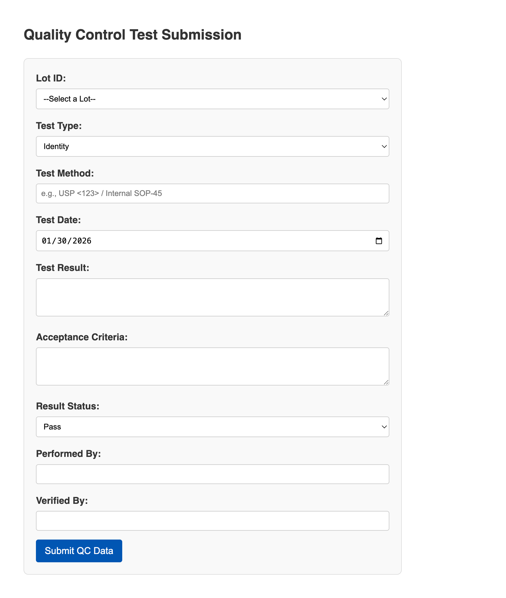

# Prototype

## QC test

### Prototype cơ bản

Gồm các mục nhập liệu cần thiết cho QC test

- Hình ảnh



- Source

```html
<!DOCTYPE html>
<html lang="en">
<head>
    <meta charset="UTF-8">
    <meta name="viewport" content="width=device-width, initial-scale=1.0">
    <title>QC Test Data Entry</title>
    <style>
        body { font-family: sans-serif; margin: 40px; line-height: 1.6; color: #333; }
        form { max-width: 600px; background: #f9f9f9; padding: 20px; border-radius: 8px; border: 1px solid #ddd; }
        div { margin-bottom: 15px; }
        label { display: block; font-weight: bold; margin-bottom: 5px; }
        input, select, textarea { width: 100%; padding: 8px; border: 1px solid #ccc; border-radius: 4px; box-sizing: border-box; }
        button { background-color: #0056b3; color: white; padding: 10px 15px; border: none; border-radius: 4px; cursor: pointer; font-size: 16px; }
        button:hover { background-color: #004494; }
    </style>
</head>
<body>

    <h2>Quality Control Test Submission</h2>
    
    <form action="https://examplepage.com" method="POST">
        
        <div>
            <label for="lot_id">Lot ID:</label>
            <select name="lot_id" id="lot_id" required>
                <option value="">--Select a Lot--</option>
                <option value="LOT-001">LOT-001</option>
                <option value="LOT-002">LOT-002</option>
                <option value="LOT-003">LOT-003</option>
            </select>
        </div>

        <div>
            <label for="test_type">Test Type:</label>
            <select name="test_type" id="test_type" required>
                <option value="1">Identity</option>
                <option value="2">Potency</option>
                <option value="3">Microbial</option>
                <option value="4">Growth Promotion</option>
                <option value="5">Physical</option>
                <option value="6">Chemical</option>
            </select>
        </div>

        <div>
            <label for="test_method">Test Method:</label>
            <input type="text" name="test_method" id="test_method" placeholder="e.g., USP <123> / Internal SOP-45" required>
        </div>

        <div>
            <label for="test_date">Test Date:</label>
            <input type="date" name="test_date" id="test_date" required>
        </div>

        <div>
            <label for="test_result">Test Result:</label>
            <textarea name="test_result" id="test_result" rows="3" required></textarea>
        </div>

        <div>
            <label for="acceptance_criteria">Acceptance Criteria:</label>
            <textarea type="text" name="acceptance_criteria" id="acceptance_criteria" rows="3"></textarea>
        </div>

        <div>
            <label for="result_status">Result Status:</label>
            <select name="result_status" id="result_status" required>
                <option value="1">Pass</option>
                <option value="2">Fail</option>
                <option value="3">Pending</option>
            </select>
        </div>

        <div>
            <label for="performed_by">Performed By:</label>
            <input type="text" name="performed_by" id="performed_by" required>
        </div>

        <div>
            <label for="verified_by">Verified By:</label>
            <input type="text" name="verified_by" id="verified_by" required>
        </div>

        <button type="submit">Submit QC Data</button>
    </form>

    <script>
        // Automatically set the date picker to today's date
        document.getElementById('test_date').valueAsDate = new Date();
    </script>

</body>
</html>
```

## Report nhập hàng

- Hình ảnh


- Source

```html
<!DOCTYPE html>
<html lang="en">
<head>
    <meta charset="UTF-8">
    <meta name="viewport" content="width=device-width, initial-scale=1.0">
    <title>Report</title>
    <style>
        * {
            box-sizing: border-box;
        }
        table {
            border: 1px solid black; /* Border for the entire table */
            border-collapse: collapse; /* Collapses borders into a single border */
        }

        th, td {
            border: 1px solid black; /* Borders for the table cells */
            padding: 8px; /* Adds space around cell content */
            text-align: left; /* Aligns text to the left */
        }
    </style>
</head>
<body>
    <h1> Inventory imported in 1/2026 </h1>
    <div style="width: 100%; height: 100%; padding: 3rem; display: flex; flex-direction: row;">
        <div style="display: flex; flex-direction: column; flex: 1;">
            <div id="div1" style="padding: 2rem; margin: 1rem; display: flex; flex-direction: column; border-style: solid; border-width: 0.3rem; border-color: blue; background-color: lightblue;">
                <h3> Lots imported </h3>
                <p style="font-size: xx-large;"> 200 </p>
                <div style="width: 100%; display: flex; align-items: center;">
                    <h3> with <p style="font-size: x-large; display: inline;"> 25 </p> different materials imported </h3>
                </div>
            </div>

            <div id="div3" style="min-width: 50%; padding: 2rem; margin: 1rem; display: flex; flex-direction: column; border-style: solid; border-width: 0.3rem; border-color: blue; background-color: lightblue;">
                <h3> Quality control </h3>
                
            </div>
        </div>

        <div id="div2" style="flex: 1; padding: 2rem; margin: 1rem; display: flex; flex-direction: column; overflow-y: scroll; border-style: solid; border-width: 0.3rem; border-color: blue; background-color: lightblue;">
            <h3> Import quantities </h3>
            <table>
                <tr>
                  <td><b>Apples</b></td>
                  <td style="font-size: large;">100 kg</td>
                </tr>
                <tr>
                  <td><b>Oranges</b></td>
                  <td style="font-size: large;">400 kg</td>
                </tr>
                <tr>
                  <td><b>Berry mix</b></td>
                  <td style="font-size: large;">60 l</td>
                </tr>
            </table>
            <div style="width: 100%; display: flex; align-items: center; gap: 3rem"> <a href=""> View more </a> </div>
        </div> 
    </div>
</body>
</html>
```