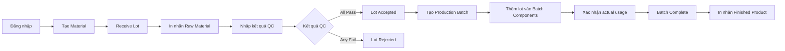
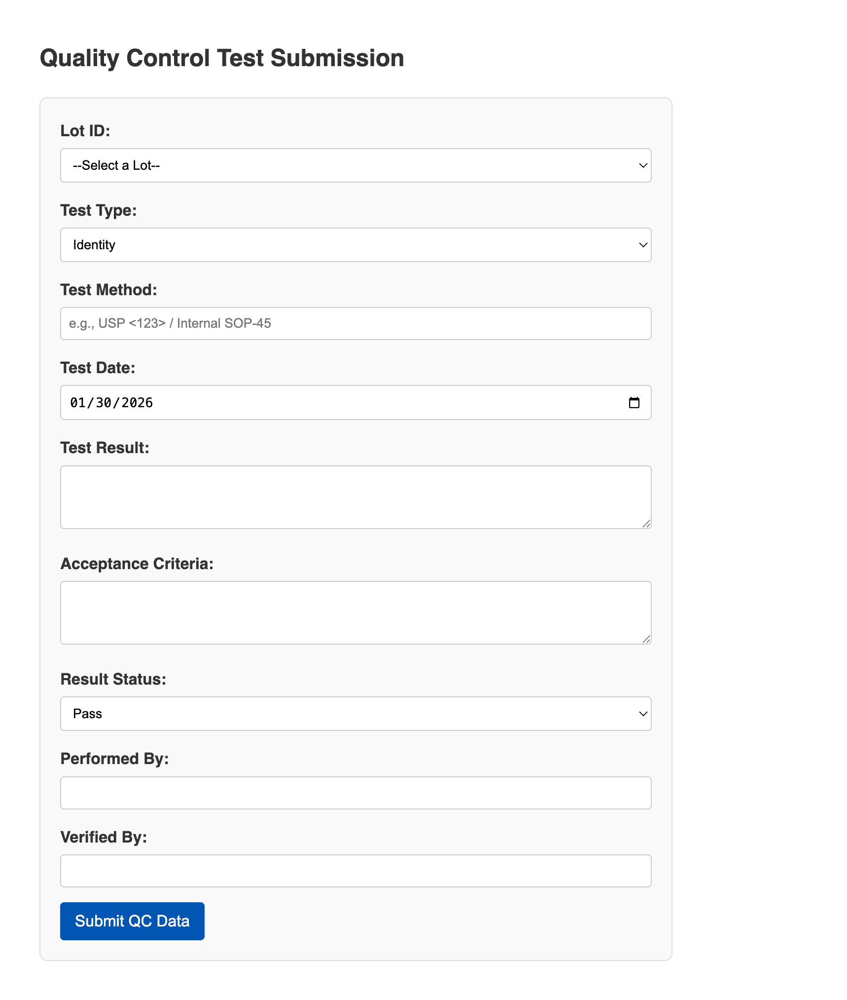

# 03 - Prototype

## 1. Mục tiêu

Tài liệu này trình bày prototype giao diện theo từng bước cho luồng nghiệp vụ chính:

- Nhận vật tư vào kho theo lot.
- QC kiểm nghiệm và duyệt trạng thái lot.
- Tạo production batch và cấp phát nguyên liệu.
- Hoàn tất batch và in nhãn thành phẩm.

Prototype đồng bộ 1-1 với PRD, Domain Model, Product Backlog, Architecture.

## 2. Luồng nghiệp vụ được prototype

### 2.1 Luồng chinh

```mermaid
flowchart LR
  A[Đăng nhập] --> B[Tạo Material]
  B --> C[Receive Lot]
  C --> D[In nhãn Raw Material]
  D --> E[Nhập kết quả QC]
  E --> F{Kết quả QC}
  F -->|All Pass| G[Lot Accepted]
  F -->|Any Fail| H[Lot Rejected]
  G --> I[Tạo Production Batch]
  I --> J[Thêm lot vào Batch Components]
  J --> K[Xác nhận actual usage]
  K --> L[Batch Complete]
  L --> M[In nhãn Finished Product]
```

### 2.2 Luồng phu

- Tách sample lot từ lot cha và in nhãn Sample.
- Adjustment/Transfer/Disposal khi có ngoai lệ vận hành.

## 3. Danh sách màn hình prototype

| Screen ID | Tên màn hình                    | Mục tiêu                                       | Map PRD             |
| --------- | ------------------------------- | ---------------------------------------------- | ------------------- |
| P-01      | Login                           | Xác thực người dùng, khởi tạo context role     | FR-01               |
| P-02      | Material List + Create/Edit     | Quản lý master data Materials                  | FR-02               |
| P-03      | Receive Lot                     | Tạo lot mới ở Quarantine + Receipt transaction | FR-03, BR-01        |
| P-04      | Raw Label Preview/Print         | In nhãn lot sau khi nhập kho                   | FR-08               |
| P-05      | QC Test Entry                   | Nhập QCTest theo lot                           | FR-04               |
| P-06      | QC Approval Result              | Đổi trạng thái lot theo kết quả QC             | FR-04, BR-03        |
| P-07      | Sample Lot Creation             | Tách lot mẫu từ lot cha                        | FR-07, BR-07        |
| P-08      | Production Batch Create         | Tạo batch cho product                          | FR-05               |
| P-09      | Batch Components + Usage        | Chọn lot hợp lệ, xác nhận actual usage         | FR-06, BR-02, BR-06 |
| P-10      | Batch Complete + Finished Label | Chuyển Complete và in nhãn thành phẩm          | FR-05, FR-08, BR-05 |
| P-11      | Traceability Report             | Truy xuất lot -> transaction -> batch          | FR-09, FR-10        |

## 4. Chi tiet prototype theo tung man hinh

## 4.1 P-01 Login

### User role

- Admin
- Manager
- QC
- Operator

### UI components

- Username
- Password
- Login button

### Validation va behavior

- Bắt buộc username va password.
- Sai thông tin hiển thị lỗi xác thực.
- Đăng nhập thành công điều hướng dashboard theo role.

## 4.2 P-02 Material List + Create/Edit

### UI components

- Bảng danh sách materials (`part_number, material_name, material_type`).
- Filter: keyword, `material_type`.
- Nút Create, Edit.

### Form fields

- `part_number` (required, unique)
- `material_name` (required)
- `material_type` (required)
- `storage_conditions`
- `specification_document`

### Acceptance points

- Lưu thành công tạo record mới.
- Trùng `part_number` thì chặn và thông báo conflict.

## 4.3 P-03 Receive Lot

### UI components

- Form tiếp nhận lot.
- Panel xem nhanh thông tin material.

### Form fields

- `material_id` (required)
- `lot_code` (required)
- `quantity` (required, > 0)
- `unit_of_measure` (required)
- `received_date` (required)
- `expiration_date` (required)
- `storage_location`

### System behavior

- Tạo InventoryLot với status Quarantine.
- Tự động tạo InventoryTransaction type Receipt (+quantity).
- Hiện thông báo tạo lot thành công.

## 4.4 P-04 Raw Label Preview/Print

### UI components

- Label template selector (Raw Material).
- Label preview panel.
- Print button.

### Data binding

- `lot_id, material_name, manufacturer_lot, expiration_date, storage_location`.

### System behavior

- Không bắt buộc tạo record mới trong DB nếu chưa có bảng log in nhãn.

## 4.5 P-05 QC Test Entry

### UI components

- Chọn lot cần test.
- Form nhập kết quả QC.
- Danh sách test đã nhập.

### Form fields

- `lot_id` (required)
- `test_type` (required)
- `test_method` (required)
- `test_date` (required)
- `result_value`
- `acceptance_criteria`
- `result_status` (Pending/Pass/Fail)
- `performed_by` (required)
- `verified_by`

### Existing mockup

- Hình prototype có sẵn:

## 4.6 P-06 QC Approval Result

### UI components

- Bảng tổng hợp test theo lot.
- Nút Approve/Reject lot (nếu role cho phép).

### Rule hien thi

- Tất cả test Pass -> lot đề xuất Accepted.
- Có ít nhất 1 test Fail -> lot đề xuất Rejected.

### System behavior

- Cập nhật InventoryLot.status theo kết quả tổng hợp.

## 4.7 P-07 Sample Lot Creation

### UI components

- Chọn lot cha.
- Form tách sample quantity.
- Preview thông tin lot con.

### Behavior

- Tạo lot con `is_sample = true`, `parent_lot_id` = lot cha.
- Ghi giao dịch tách mẫu (Split/Receipt theo quy tắc hệ thống).
- Hỗ trợ in nhãn Sample.

## 4.8 P-08 Production Batch Create

### UI components

- Form tạo batch.

### Form fields

- product_id (required)
- batch_number (required)
- batch_size (required)
- unit_of_measure (required)
- manufacture_date
- expiration_date

### Behavior

- Tạo batch mới ở status Planned.

## 4.9 P-09 Batch Components + Usage

### UI components

- Chọn lot cho batch.
- Nhập planned_quantity và actual_quantity.
- Bảng components đã thêm.

### Rule

- Chỉ cho chọn lot Accepted, còn tồn, chua hết han.
- Confirm usage tạo transaction Usage.

### Data update

- Trừ InventoryLots.quantity theo actual usage.
- Nếu quantity về 0 thì có thể chuyển Depleted.

## 4.10 P-10 Batch Complete + Finished Label

### UI components

- Nút chuyển status batch.
- Preview nhãn Finished Product.

### Behavior

- Chỉ cho Complete khi đạt điều kiện usage.
- In nhãn Finished Product sau khi Complete.

## 4.11 P-11 Traceability Report

### UI components

- Filter theo lot, material, date range, status.
- Bảng transaction timeline.
- Tổng hợp KPI cơ bản.

### Existing mockup

- Hình prototype report có sẵn:

## 5. Prototype states và error states

- Empty state: chưa có dữ liệu lot/batch.
- Loading state: đang tải danh sách lot/material.
- Validation error state: thiếu trường bắt buộc, sai định dạng.
- Business rule error state:
  - Không được usage lot không Accepted.
  - Không được usage lot không đủ tồn.
  - Không được Complete batch nếu chưa đủ điều kiện.
- Permission denied state: role không đủ quyền thao tác.

## 6. Traceability 1-1 voi PRD

| PRD   | Prototype Screen                               |
| ----- | ---------------------------------------------- |
| FR-01 | P-01                                           |
| FR-02 | P-02                                           |
| FR-03 | P-03                                           |
| FR-04 | P-05, P-06                                     |
| FR-05 | P-08, P-10                                     |
| FR-06 | P-09                                           |
| FR-07 | P-07                                           |
| FR-08 | P-04, P-10                                     |
| FR-09 | P-11                                           |
| FR-10 | P-11 + audit hints trên các màn hình giao dịch |

## 7. Kế hoạch nâng cấp prototype

- Chuyển từ low-fidelity sang clickable prototype theo role.
- Bổ sung luồng Rejected lot và luồng Disposal chi tiết.
- Bổ sung màn hình role matrix cho Admin.
- Bổ sung dashboard KPI theo NFR-02/NFR-04.
