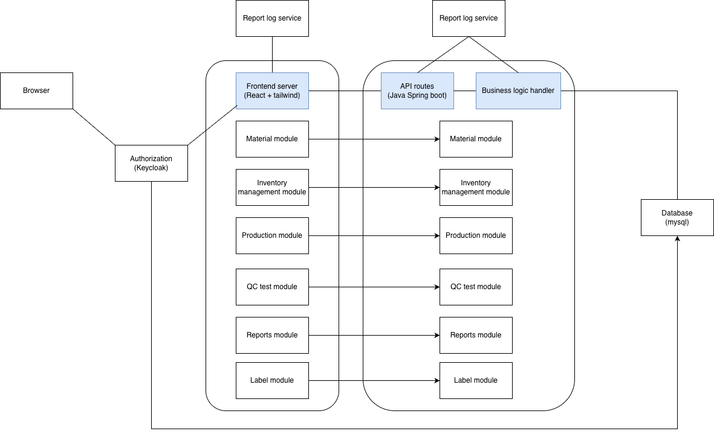

# Architecture

## Logical view

## Development view

### Root level

/se-project
├── 01_Documents    # Project specifications, design and standards
├── 02_Source
　├── frontend/               # React + Tailwind project
　├── backend/                # Java Spring Boot project
　└── docker-compose.yml      # Orchestrates MySQL, Keycloak, and Apps
├── README.md
└── 03_Deployment

### Frontend

frontend/
├── public/
├── src/
│   ├── assets/             # Global styles (Tailwind config), images
│   ├── common/             # Shared components (Buttons, Inputs, Layouts)
│   ├── features/           # The "Modules" from your diagram
│   │   ├── material/
│   │   ├── inventory/
│   │   ├── qc-test/
│   │   ├── production/
│   │   ├── label/
│   │   ├── reports/
│   │   └── log/        # Components and logic for logging runtime
│   ├── services/           # API clients (Axios/Fetch) to talk to Spring Boot
│   ├── auth/               # Keycloak integration logic
│   ├── App.js              # Main routes and Auth provider
│   └── index.js
├── tailwind.config.js
└── package.json

### Backend

backend/
├── src/main/java/com/company/project/
│   ├── config/             # Keycloak & Security configurations
│   ├── common/             # Shared exceptions, utilities, or DTOs
│   ├── modules/            # Domain-specific logic
│   │   ├── material/
│   │   ├── inventory/
│   │   ├── qc-test/
│   │   ├── production/
│   │   ├── label/
│   │   ├── reports/
│   │   └── log/       
│   └── Application.java    # Main entry point
├── src/main/resources/
│   ├── application.yml     # Database & Keycloak properties
│   └── mapper/             # (Optional) MyBatis or SQL templates
└── pom.xml                 # Dependencies (Spring Security, MySQL, etc.)