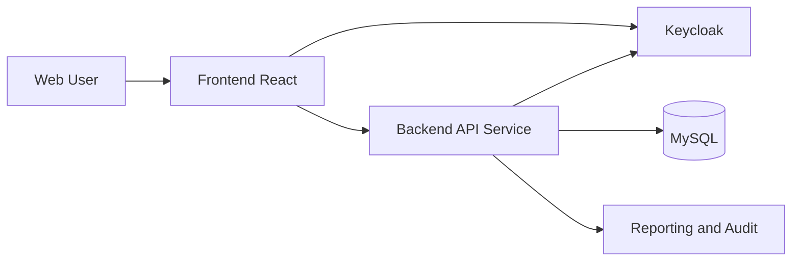
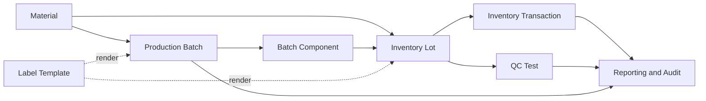
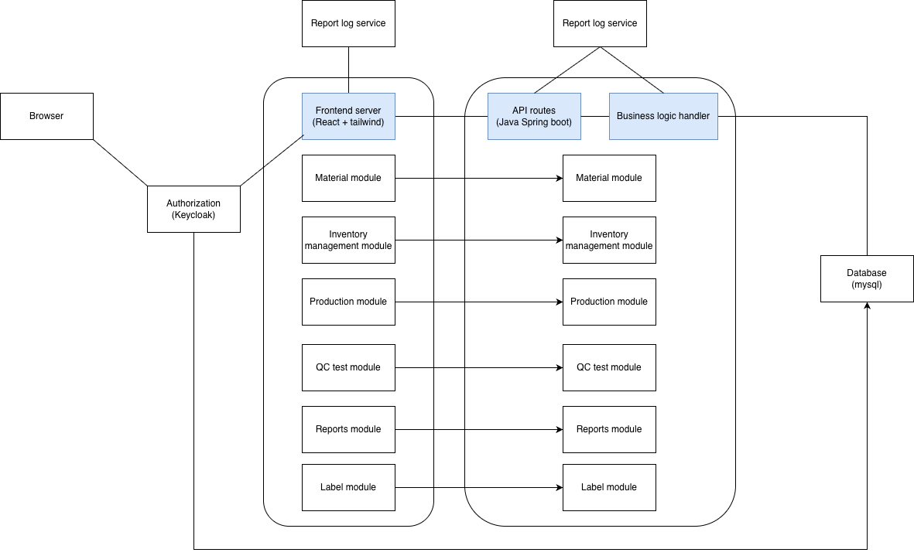
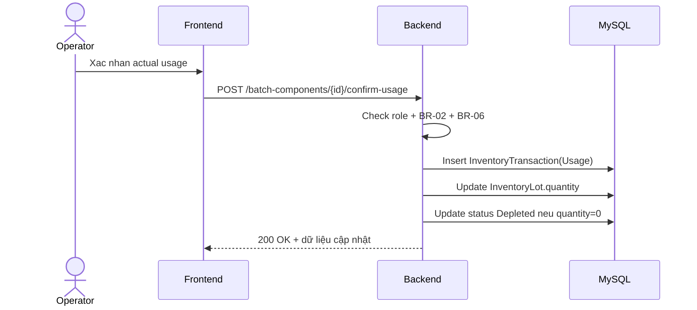
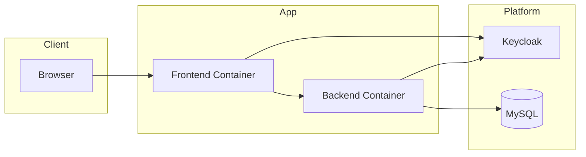

# 05 - Architecture

## 1. Mục tiêu kiến trúc

Kiến trúc hệ thống được thiết kế để đáp ứng trực tiếp các mục tiêu trong PRD:

- Chuẩn hóa vòng đời lot từ Receipt đến Depleted.
- Đảm bảo chỉ lot Accepted mới được dùng cho sản xuất.
- Truy xuất đầy đủ lot -> QC -> usage -> batch.
- Bảo mật theo RBAC và có audit trail cho thao tác quan trọng.

## 2. Kiến trúc tổng thể


```mermaid
flowchart LR
	U[Web User] --> FE[Frontend React]
	FE --> BE[Backend API Service]
	FE --> IAM[Keycloak]
	BE --> IAM
	BE --> DB[(MySQL)]
	BE --> REP[Reporting and Audit]
```

## 3. Logical view

### 3.1 Các module nghiệp vụ chính

- Identity and Access Module:
  - Đăng nhập, phân quyền role, kiểm soát truy cập.
- Material Module:
  - Quản lý master data vật tư/sản phẩm.
- Inventory Module:
  - Quản lý lot, transaction, trạng thái tồn.
- QC Module:
  - Quản lý QCTest và rule đổi trạng thái lot.
- Production Module:
  - Quản lý batch, batch components, usage.
- Label Module:
  - Quản lý template và kết xuất nhãn.
- Reporting and Audit Module:
  - Truy xuất giao dịch, dashboard và lịch sử thay đổi.

### 3.2 Quan hệ logic giữa module


```mermaid
flowchart LR
	MAT[Material] --> INV[Inventory Lot]
	INV --> QC[QC Test]
	INV --> TX[Inventory Transaction]
	MAT --> PB[Production Batch]
	PB --> BC[Batch Component]
	BC --> INV
	LAB[Label Template] -.render.-> INV
	LAB -.render.-> PB
	TX --> REP[Reporting and Audit]
	QC --> REP
	PB --> REP
```

Hình logical view tổng quát hiện có:



## 4. Process view

### 4.1 Quy trình chính runtime

1. Người dùng thao tác trên Frontend.
2. Frontend gọi Backend API kèm access token.
3. Backend xác thực/ủy quyền qua Keycloak.
4. Backend thực thi rule nghiệp vụ và ghi dữ liệu MySQL.
5. Backend trả kết quả để Frontend hiển thị.

### 4.2 Sequence rút gọn cho usage nguyên liệu


```mermaid
sequenceDiagram
	actor OP as Operator
	participant FE as Frontend
	participant BE as Backend
	participant DB as MySQL

	OP->>FE: Xac nhan actual usage
	FE->>BE: POST /batch-components/{id}/confirm-usage
	BE->>BE: Check role + BR-02 + BR-06
	BE->>DB: Insert InventoryTransaction(Usage)
	BE->>DB: Update InventoryLot.quantity
	BE->>DB: Update status Depleted neu quantity=0
	BE-->>FE: 200 OK + dữ liệu cập nhật
```

## 5. Development view

### 5.1 Cấu trúc thư mục mức cao

```text
/project-se
|-- 01_Documents
|-- 02_Source/01_Source Code
|   |-- backend
|   |-- frontend
|   `-- docker-compose.yml
`-- 03_Deployment
```

### 5.2 Frontend view

```text
frontend/src
|-- auth
|-- components
|-- pages
|-- services
`-- main.jsx
```

Nguyên tắc tổ chức:

- Tách theo feature nghiệp vụ: material, inventory, qc-test, production, label, reports.
- Tầng service chịu trách nhiệm gọi API và chuẩn hóa dữ liệu trả về.
- Tầng UI chỉ xử lý trình bày và tương tác.

### 5.3 Backend view

```text
backend/src/main/java
`-- com/.../
		|-- config
		|-- common
		`-- modules
				|-- material
				|-- inventory
				|-- qctest
				|-- production
				|-- label
				`-- report
```

Nguyên tắc tổ chức:

- Mỗi module quản lý use case riêng, giảm coupling.
- Layer chuẩn: controller -> service -> repository -> database.
- Quy tắc nghiệp vụ tập trung ở service/domain logic, không dàn trải ở controller.

## 6. Data view

### 6.1 Các bảng lõi

- users
- materials
- inventory_lots
- inventory_transactions
- qc_tests
- production_batches
- batch_components
- label_templates

### 6.2 Quy tắc toàn vẹn dữ liệu

- part_number của materials là unique.
- inventory_transactions luôn tham chiếu lot hợp lệ.
- batch_components luôn tham chiếu batch và lot hợp lệ.
- quantity của lot thay đổi qua transaction, không chỉnh tay trực tiếp.

## 7. Security view

- IAM dùng Keycloak (không tự phát triển auth core).
- Phân quyền RBAC theo role: Admin, Manager, QC, Operator.
- Endpoint backend kiểm tra token và quyền truy cập trước khi xử lý nghiệp vụ.
- Audit trail cho thao tác quan trọng.

## 8. Deployment view


```mermaid
flowchart LR
	subgraph Client
		B[Browser]
	end
	subgraph App
		F[Frontend Container]
		S[Backend Container]
	end
	subgraph Platform
		K[Keycloak]
		D[(MySQL)]
	end
	B --> F
	F --> S
	F --> K
	S --> K
	S --> D
```

Môi trường triển khai định hướng:

- Local/Dev: docker-compose.
- Staging/Production: containerized deployment theo tài liệu deployment.

## 9. Technology stack

### Backend

- Java + Spring Boot
- Gradle
- MySQL
- Keycloak adapter/integration

### Frontend

- React
- Vite
- TanStack Query
- Axios

## 10. Quyết định kiến trúc quan trọng

- ADR-01: Dùng RBAC thông qua Keycloak để đáp ứng NFR-01.
- ADR-02: Dùng transaction log làm nguồn chuẩn cho truy xuất tồn kho và audit.
- ADR-03: Dùng template-driven labeling để tái sử dụng nhiều loại nhãn.
- ADR-04: Tách module theo domain để thuận lợi mở rộng microservice trong giai đoạn sau.

## 11. Đồng bộ 1-1 với PRD (traceability)

| PRD item | Thành phần kiến trúc chính                                |
| -------- | --------------------------------------------------------- |
| FR-01    | Security view + Identity module                           |
| FR-02    | Material module + data table materials                    |
| FR-03    | Inventory module + inventory_lots + transactions          |
| FR-04    | QC module + qc_tests + status rules                       |
| FR-05    | Production module + production_batches + batch_components |
| FR-06    | Process usage flow + inventory_transactions               |
| FR-07    | Inventory logic for sample lot                            |
| FR-08    | Label module + label_templates                            |
| FR-09    | Reporting and Audit module                                |
| FR-10    | Audit trail + user references                             |
| NFR-01   | RBAC + Keycloak integration                               |
| NFR-02   | Module separation + performance-focused query path        |
| NFR-03   | Data integrity + backup in deployment design              |
| NFR-04   | Traceability and reporting architecture                   |

## 12. Rủi ro kiến trúc và hướng giảm thiểu

- Rủi ro đồng bộ trạng thái lot khi concurrent usage:
  - Giảm thiểu bằng DB transaction, optimistic locking hoặc row-level lock.
- Rủi ro hiệu năng truy vấn lịch sử lớn:
  - Giảm thiểu bằng index theo lot_id, batch_id, transaction_date.
- Rủi ro sai lệch rule nghiệp vụ giữa frontend/backend:
  - Giảm thiểu bằng việc backend là nguồn kiểm tra rule cuối cùng.
